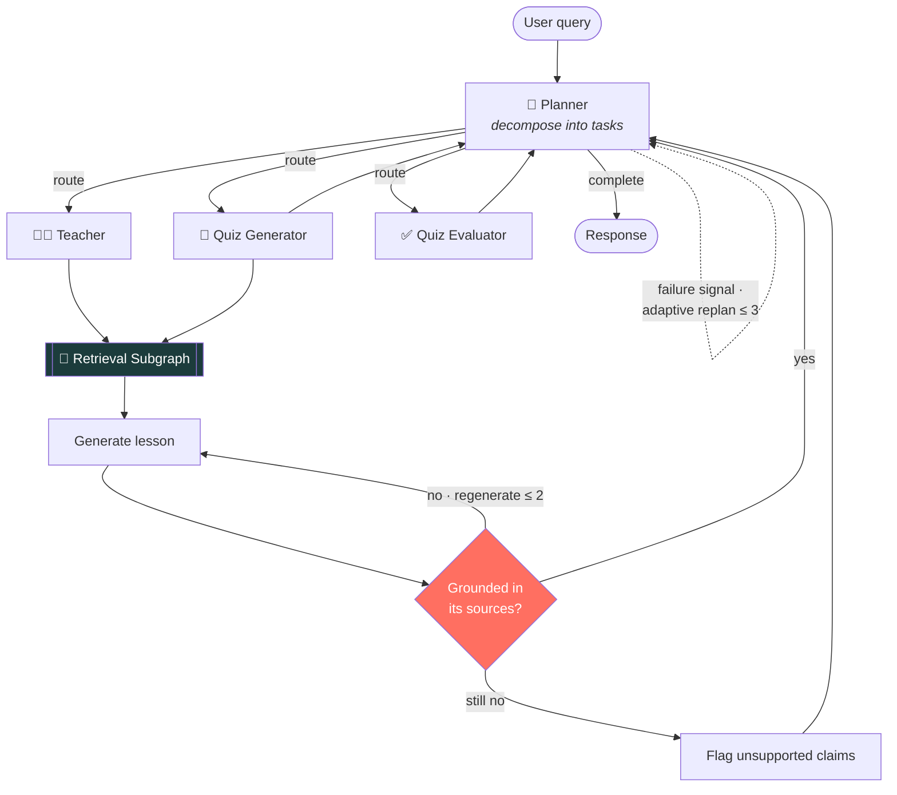
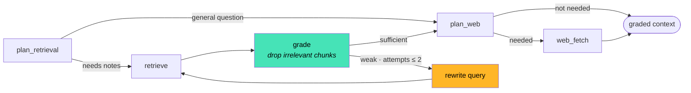

<div align="center">

# 📚 Agentic RAG Study Helper

**An agentic RAG study assistant that grades its own retrieval, verifies its own answers, and admits when it doesn't know.**

[](https://agentic-rag-studyhelper.onrender.com)
[](https://agentic-rag-studyhelper.onrender.com/docs)


</div>

> ⏱️ **The live demo runs on a free tier** — it spins down when idle, so the **first request takes ~50s** to wake it. After that it's fast.

---

## The problem with most RAG demos

Naive RAG retrieves the top-k chunks by similarity and stuffs them into the prompt — noise included. It can't tell a relevant chunk from a plausible-looking wrong one, and when the answer isn't in your notes, it invents one.

**This project fixes that — and measures the fix.**

## 📊 Does the "agentic" machinery actually earn its keep?

Benchmarked against naive RAG on identical data. The metrics are **deterministic** — computed from ground-truth relevance labels, not an LLM's opinion.

| Metric | Naive RAG | **This project** | Delta |
|:---|:---:|:---:|:---:|
| **Retrieval precision** | 0.396 | **1.000** | 🟢 **+153%** |
| **Retrieval recall** | 1.000 | **1.000** | ⚪ no loss |
| **Retrieval F1** | 0.558 | **1.000** | 🟢 **+79%** |
| **Distractor rejection** | 0.042 | **1.000** | 🟢 **4% → 100%** |
| **Hallucination rate** *(unanswerable queries)* | 0.500 | **0.000** | 🟢 **−100%** |
| Chunks fed to the generator | 3.17 | 1.00 | 🟢 −68% noise |
| Retrieval latency | 0.02s | 1.10s | 🔴 **+1.08s** — the honest cost |

**Grading eliminated 100% of distractors and ~2.5×'d precision with zero recall loss, for about one extra second per query.**

The decisive case is `mitosis-vs-meiosis`: a *near-miss* chunk about meiosis ranks highly for a mitosis question because embeddings can't tell them apart. Naive scored 0.33 precision there — only grading rejects it.

<sub>Reproduce: <code>python evaluation/run_eval.py --variant naive</code> then <code>--variant advanced</code>, compare in <code>mlflow ui</code>. Full write-up: <b><a href="evaluation/metrics/README.md">evaluation/metrics/</a></b></sub>

---

## 🏗️ Architecture



### The retrieval subgraph — where the self-correction lives



**Every loop is hard-capped** (`retrieval ≤ 2`, `generation ≤ 2`, `replans ≤ 3`) — self-correction that provably terminates and can't run away with your token budget.

---

## ✨ What it does

| | |
|---|---|
| 🎓 **Teaches** | Explains topics from your uploaded PDFs or general knowledge, step by step in Markdown |
| 📝 **Quizzes** | Generates MCQ / True-False / short-answer questions from your notes |
| ✅ **Evaluates** | Grades answers — verdict for MCQ/TF, a 0–5 rubric rating for short answers |
| 🧭 **Plans adaptively** | An LLM planner decomposes requests and **re-plans on failure**, staying out of the way when things succeed |
| 🔁 **Self-corrects retrieval** | Grades every chunk, rewrites the query and retries when retrieval is weak *(CRAG)* |
| 🔎 **Verifies its answers** | Checks lessons are grounded in their sources; regenerates or flags unsupported claims *(Self-RAG)* |
| 🙅 **Admits ignorance** | If you ask about your notes and they don't cover it, it says so instead of inventing an answer |
| 🌐 **Falls back to the web** | Searches only when your notes genuinely fall short |
| 💾 **Remembers** | Conversation and quiz state survive a server restart (LangGraph checkpointer) |
| 👥 **Isolates users** | Every document, vector and thread is scoped to a session — no cross-user leakage |
| 📡 **Streams** | SSE node-by-node progress ("Planning…", "Researching…") |

---

## 🧰 Stack

| Layer | Choice | Why |
|---|---|---|
| **Orchestration** | LangGraph | Stateful graph + checkpointing for the self-correcting loops |
| **API** | FastAPI | Async, SSE streaming, auto OpenAPI docs |
| **LLM** | Groq · `llama-3.3-70b-versatile` | Fast, generous free tier |
| **Embeddings** | `all-MiniLM-L6-v2` via **fastembed (ONNX)** | Same model as sentence-transformers, **~15 MB instead of ~2.5 GB** — no PyTorch |
| **Vectors** | pgvector *(prod)* · Chroma *(local)* | One datastore in prod; no paid disk required |
| **State** | Neon Postgres | Free, non-expiring; holds sessions, documents **and** checkpoints |
| **Tracing** | LangSmith | Every node + LLM call, auto-enabled by env var |
| **Evaluation** | MLflow | Ablation runs, comparable over time |
| **Deploy** | Render (Docker) | Free tier, no card |

---

## 🚀 Quick start

```bash
git clone https://github.com/Pranjaltyagi76/agentic-rag-studyhelper.git
cd agentic-rag-studyhelper

python -m venv .venv && .venv\Scripts\activate         # Windows
# python3 -m venv .venv && source .venv/bin/activate   # macOS / Linux

pip install -r requirements.txt
cp .env.example .env        # then add your keys
uvicorn app.main:app --port 8000
```

Open **http://127.0.0.1:8000** — the app is served at the root.

**Keys needed** (all free): [Groq](https://console.groq.com) · [Tavily](https://app.tavily.com) · [Google AI Studio](https://aistudio.google.com/apikey) *(only for OCR of scanned PDFs)*.
`DATABASE_URL` is optional locally — it defaults to SQLite.

<details>
<summary><b>🐳 Docker (mirrors production on pgvector)</b></summary>

```bash
docker compose up --build     # app on :8000, pgvector Postgres on :5432
```
</details>

---

## 📡 API

| Method | Endpoint | |
|:---|:---|:---|
| `GET` | `/` | The web app |
| `GET` | `/health` | Health check |
| `GET` | `/docs` | Interactive OpenAPI docs |
| `POST` | `/upload` | Upload a PDF (OCR fallback for scans) |
| `POST` | `/chat` | Run the agent |
| `POST` | `/chat/stream` | Same, streamed via SSE |
| `POST` | `/evaluate` | Grade a quiz answer |

```bash
curl -X POST https://agentic-rag-studyhelper.onrender.com/chat \
  -H "Content-Type: application/json" \
  -d '{"session_id":"demo-1","query":"Teach me photosynthesis"}'
```

---

## 🔬 Evaluation

```bash
python evaluation/run_eval.py --variant naive       # baseline
python evaluation/run_eval.py --variant advanced    # this pipeline
mlflow ui --backend-store-uri sqlite:///mlflow.db   # compare at :5000
```

A 6-case adversarial set — distractors, a **near-miss**, a **multi-hop** case, and two **unanswerable** hallucination probes — with every chunk labelled relevant/irrelevant so precision and recall come from ground truth rather than a judge's opinion.

📄 **[Full results & methodology →](evaluation/metrics/README.md)**

---

## 🛠️ Engineering notes

Things worth knowing about how this was actually built:

- **The benchmark caught a bug no other test could.** It found the pipeline correctly retrieving *nothing* for unanswerable questions — then answering from general knowledge anyway, ignoring the user's "according to my notes" scoping. 100% hallucination on that probe. A source-scoping guard took it to **0%**, with retrieval F1 unchanged.
- **…and then the benchmark showed its own blind spot.** It scored a perfect 1.00 F1 while production was *refusing to answer basic questions* — because every eval case had uploaded files, and the bug only fired when a user had none. **Offline evals and real traffic catch different things.**
- **Groq's structured output intermittently rejects its own valid generations** (`tool_use_failed` on apostrophes — "Newton's laws" would 500). Handled by retrying and then *salvaging the JSON out of the rejected response*.
- **`str([]) == "[]"`** — empty web results were passed downstream as a non-empty string, so the model dutifully narrated that the research contained nothing.
- **A production checkpointer bug, caught pre-flight:** `PostgresSaver.from_conn_string()` returns a context manager whose connection closes immediately — it would have silently killed all memory in production. Replaced with a real connection pool.
- **Degradation is never silent.** If the grader's LLM call fails, chunks pass through ungraded — that's an *outage*, not a quality decision, so it's flagged and excluded from the metrics rather than quietly inflating them.

---

## ⚖️ Honest limitations

- **Cold starts.** The free tier sleeps after 15 min idle → ~50s first request.
- **The eval is 6 curated cases.** Designed to isolate failure modes, not a large-scale benchmark.
- **No per-user auth.** Sessions are unguessable tokens and an optional `APP_API_KEY` gates the API; real accounts are future work.
- **Self-correction costs tokens.** Each request makes several LLM calls (bounded by the caps). Groq's free tier is 100k tokens/day — reachable under heavy testing.
- **The regenerate-on-ungrounded path is wired and capped but rarely observed firing** — it's hard to force deterministically.

---

## 📁 Structure

```
app/
├── agent/          # LangGraph: planner, teacher, quiz, retrieval subgraph, state
├── api/            # FastAPI routers: upload, chat (+SSE), evaluate
├── persistence/    # vector store, Postgres models, checkpointer
├── observability/  # LangSmith tracing, retrieval metrics
└── main.py         # app assembly, CORS, error envelope, serves the frontend
evaluation/         # ablation harness, judges, dataset, metrics write-up
```

Design docs: **[ARCHITECTURE](ARCHITECTURE.md)** · **[requirements](requirements.md)** · **[design](design.md)** · **[roadmap](roadmap.md)** · **[deployment](deployment.md)** · **[strategy](strategy.md)** *(includes the decision log)*

---

## 🎯 Future work

Flashcard generation · study planner · multi-document reasoning · per-user auth · a larger eval set

---

<div align="center">
<sub>Built with LangGraph · FastAPI · Groq · Neon · Render — running on <b>$0</b> of infrastructure.</sub>
</div>
