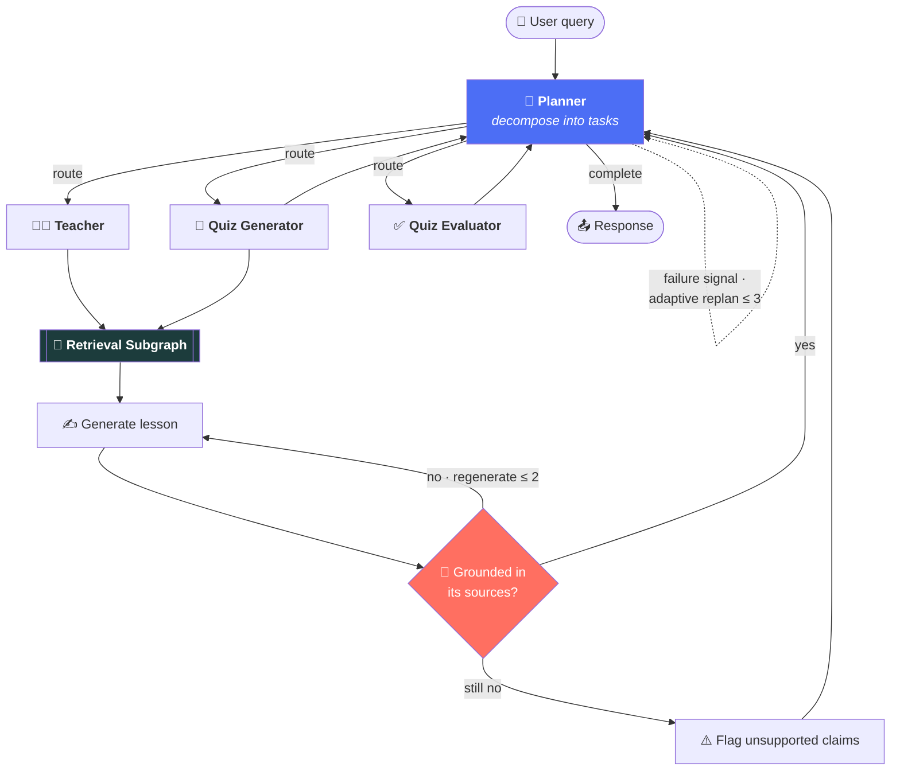
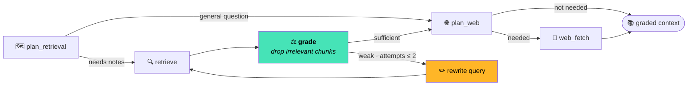

<div align="center">

# 📚 Agentic RAG Study Helper

### *An agentic RAG study assistant that grades its own retrieval, verifies its own answers, and admits when it doesn't know.*

<br/>

### 🔗 **[▶ TRY THE LIVE APP](https://agentic-rag-studyhelper.onrender.com)**

**`https://agentic-rag-studyhelper.onrender.com`**

[](https://agentic-rag-studyhelper.onrender.com)
[](https://agentic-rag-studyhelper.onrender.com/docs)
[](https://agentic-rag-studyhelper.onrender.com/health)

<br/>


</div>

> [!NOTE]
> **The live demo runs on a free tier.** It sleeps when idle, so the **first request takes ~50s** to wake it. After that it's responsive. A 1-page PDF ingests in ~12s; a 20-page one takes ~60–90s (0.1 CPU is the price of $0).

---

## 📑 Contents

- [Why this exists](#-why-this-exists)
- [Does the machinery earn its keep?](#-does-the-agentic-machinery-actually-earn-its-keep) ← **the proof**
- [Architecture](#️-architecture)
- [What it does](#-what-it-does)
- [Tech stack](#-tech-stack)
- [**Run it yourself**](#-run-it-yourself) ← **clone & run**
- [Configuration](#️-configuration)
- [API reference](#-api-reference)
- [Evaluation](#-evaluation)
- [Engineering notes](#️-engineering-notes)
- [Limitations](#️-honest-limitations)

---

## 🎯 Why this exists

Naive RAG retrieves the top-k chunks by cosine similarity and stuffs them into the prompt — **noise included**. It cannot tell a relevant chunk from a plausible-looking wrong one, and when the answer isn't in your notes, it cheerfully invents one.

This project adds **three self-correcting loops** on top of RAG:

```
🔁  Retrieval    →  grade every chunk · rewrite the query · retry        (CRAG)
🔎  Generation   →  verify the answer is grounded · regenerate · flag    (Self-RAG)
🧭  Planning     →  re-plan when a step fails                            (agentic)
```

…and then **measures whether any of it was worth it.**

---

## 📊 Does the "agentic" machinery actually earn its keep?

Benchmarked head-to-head against naive RAG on **identical data**. Metrics are **deterministic** — computed from ground-truth relevance labels, not an LLM's opinion of itself.

<div align="center">

| Metric | 🔴 Naive RAG | 🟢 **This project** | Delta |
|:---|:---:|:---:|:---:|
| **Retrieval precision** | 0.396 | **1.000** | **+153%** |
| **Retrieval recall** | 1.000 | **1.000** | *no loss* |
| **Retrieval F1** | 0.558 | **1.000** | **+79%** |
| **Distractor rejection** | 0.042 | **1.000** | **4% → 100%** |
| **Hallucination rate** <br/><sub>on unanswerable questions</sub> | 0.500 | **0.000** | **−100%** |
| Chunks fed to generator | 3.17 | **1.00** | −68% noise |
| Retrieval latency | **0.02s** | 1.10s | **+1.08s** ← *the honest cost* |

</div>

> **Grading eliminated 100% of distractors and ~2.5×'d precision with zero recall loss — for about one extra second per query.**

**The decisive case:** `mitosis-vs-meiosis`. A chunk about *meiosis* ranks highly for a *mitosis* question — embeddings can't tell them apart. Naive scored **0.33** precision there. Only an LLM grader rejects it.

<sub>▶ Reproduce: <code>python evaluation/run_eval.py --variant naive</code> → <code>--variant advanced</code> → compare in <code>mlflow ui</code>. Full methodology: <b><a href="evaluation/metrics/README.md">evaluation/metrics/README.md</a></b></sub>

---

## 🏗️ Architecture

### The agent graph



### The retrieval subgraph — where the self-correction lives



### Lifecycle of one request

```mermaid
sequenceDiagram
    autonumber
    participant U as 🙋 User
    participant API as ⚡ FastAPI
    participant G as 🕸️ LangGraph
    participant V as 🧮 pgvector
    participant L as 🤖 Groq
    participant DB as 💾 Neon

    U->>API: POST /chat/stream
    API->>G: invoke (thread_id = session)
    G->>DB: load checkpoint (memory)
    G->>L: plan tasks
    G-->>U: SSE "Planning…"
    G->>L: plan retrieval
    G->>V: similarity search (session-scoped)
    V-->>G: candidate chunks
    G->>L: grade chunks
    Note over G,L: irrelevant chunks dropped;<br/>weak? rewrite & retry (≤2)
    G-->>U: SSE "Researching…"
    G->>L: generate lesson
    G->>L: verify groundedness
    Note over G,L: ungrounded? regenerate (≤2)<br/>else flag claims
    G->>DB: save checkpoint
    G-->>U: SSE final state
```

> **Every loop is hard-capped** — `retrieval ≤ 2`, `generation ≤ 2`, `replans ≤ 3`. Self-correction that provably terminates and can't run away with your token budget.

---

## ✨ What it does

| | Feature | |
|:---:|---|---|
| 🎓 | **Teaches** | Explains topics from your PDFs or general knowledge, step by step in Markdown |
| 📝 | **Quizzes** | MCQ / True-False / short-answer, generated from your notes |
| ✅ | **Evaluates** | Verdict for MCQ/TF; a 0–5 rubric rating for short answers |
| 🧭 | **Plans adaptively** | Decomposes requests; **re-plans on failure**, stays out of the way on success |
| 🔁 | **Self-corrects retrieval** | Grades every chunk, rewrites the query and retries when retrieval is weak |
| 🔎 | **Verifies answers** | Checks lessons are grounded in sources; regenerates or flags unsupported claims |
| 🙅 | **Admits ignorance** | Asks about your notes and they don't cover it? It says so instead of inventing |
| 🌐 | **Web fallback** | Searches only when your notes genuinely fall short |
| 💾 | **Remembers** | Conversation + quiz state survive a server restart |
| 👥 | **Isolates users** | Every document, vector and thread scoped to a session — no cross-user leakage |
| 📡 | **Streams** | SSE node-by-node progress ("Planning…", "Researching…") |
| 🔍 | **Observable** | Every node + LLM call traced to LangSmith |

---

## 🧰 Tech stack

| Layer | Choice | Why this one |
|---|---|---|
| **Orchestration** | LangGraph | Stateful graph + checkpointing — the self-correcting loops need both |
| **API** | FastAPI | Async, SSE streaming, auto-generated OpenAPI docs |
| **LLM** | Groq · `llama-3.3-70b-versatile` | Very fast inference, generous free tier |
| **Embeddings** | `all-MiniLM-L6-v2` via **fastembed (ONNX)** | Same model as sentence-transformers at **~15 MB instead of ~2.5 GB** — no PyTorch |
| **Vectors** | pgvector *(prod)* · Chroma *(local)* | One datastore in prod; no paid disk needed |
| **State** | Neon Postgres | Free, non-expiring; holds sessions, documents **and** LangGraph checkpoints |
| **Tracing** | LangSmith | Auto-enables from an env var; zero code changes |
| **Evaluation** | MLflow | Ablation runs, comparable across changes |
| **Deploy** | Render (Docker) | Genuinely free, no credit card |

---

## 🚀 Run it yourself

### Prerequisites

| | |
|---|---|
| **Python 3.11+** | `python --version` — [download](https://www.python.org/downloads/) |
| **Git** | `git --version` — [download](https://git-scm.com/downloads) |
| **API keys** | Free — see [step 4](#4️⃣-get-your-free-api-keys) |

<br/>

### 1️⃣ Clone the repo

```bash
git clone https://github.com/Pranjaltyagi76/agentic-rag-studyhelper.git
cd agentic-rag-studyhelper
```

### 2️⃣ Create a virtual environment

<details open>
<summary><b>🪟 Windows (PowerShell)</b></summary>

```powershell
python -m venv .venv
.\.venv\Scripts\Activate.ps1
```
*Blocked by an execution policy? Run `Set-ExecutionPolicy -Scope Process -Bypass` once, then retry.*
</details>

<details>
<summary><b>🐧 macOS / Linux</b></summary>

```bash
python3 -m venv .venv
source .venv/bin/activate
```
</details>

Your prompt should now show `(.venv)`.

### 3️⃣ Install dependencies

```bash
pip install -r requirements.txt
```
*~2 minutes. No PyTorch — embeddings run on ONNX, so this stays light.*

### 4️⃣ Get your free API keys

| Key | Needed for | Get it free at | Required? |
|---|---|---|:---:|
| `GROQ_API_KEY` | The LLM — teaching, quizzes, planning, grading | **[console.groq.com](https://console.groq.com)** → API Keys | ✅ **Yes** |
| `TAVILY_API_KEY` | Web-search fallback | **[app.tavily.com](https://app.tavily.com)** → API Keys | ✅ **Yes** |
| `GOOGLE_API_KEY` | Gemini OCR — *only* for scanned PDFs | **[aistudio.google.com](https://aistudio.google.com/apikey)** | ⚪ Optional |
| `LANGCHAIN_API_KEY` | LangSmith tracing | **[smith.langchain.com](https://smith.langchain.com)** → Settings | ⚪ Optional |

### 5️⃣ Configure your environment

```bash
cp .env.example .env        # Windows:  copy .env.example .env
```

Open `.env` and paste your keys in:

```ini
GROQ_API_KEY=gsk_your_key_here
TAVILY_API_KEY=tvly-your_key_here
GOOGLE_API_KEY=            # optional
LANGCHAIN_API_KEY=         # optional — tracing turns on by itself once filled
```

> [!TIP]
> **No database setup needed.** `DATABASE_URL` is unset by default → it uses a local SQLite file, and vectors go to a local Chroma folder. Zero configuration.

### 6️⃣ Run it

```bash
uvicorn app.main:app --port 8000 --reload
```

### 7️⃣ Open the app

**→ [http://127.0.0.1:8000](http://127.0.0.1:8000)**

Upload a PDF, then try:
- *"Teach me photosynthesis from my notes"*
- *"Quiz me on photosynthesis"* → answer a question → get graded

<br/>

<details>
<summary><b>🐳 Or run with Docker (mirrors production on pgvector)</b></summary>

```bash
docker compose up --build
```
Brings up the app on **:8000** plus a pgvector Postgres on **:5432** — the same vector backend production uses.
</details>

<details>
<summary><b>🧯 Troubleshooting</b></summary>

| Problem | Fix |
|---|---|
| `ModuleNotFoundError` | The venv isn't active — your prompt must show `(.venv)` |
| `Activate.ps1 cannot be loaded` | `Set-ExecutionPolicy -Scope Process -Bypass`, then retry |
| `GroqError: api_key must be set` | `GROQ_API_KEY` missing/empty in `.env` |
| First request is slow | One-time: it downloads the ~83 MB embedding model |
| `429 rate_limit_exceeded` | Groq's free tier is 100k tokens/day — wait for the reset |
| Port already in use | `uvicorn app.main:app --port 8001` |
| Retrieval finds nothing | Re-upload after changing embedding models — old vectors live in a different space |
</details>

---

## ⚙️ Configuration

Everything is env-driven ([`.env.example`](.env.example) has them all). The interesting ones:

| Variable | Default | What it does |
|---|---|---|
| `DATABASE_URL` | *SQLite* | Set to a Postgres URL for prod (**required** when `APP_ENV=production`) |
| `VECTOR_BACKEND` | `chroma` | `chroma` (local) or `pgvector` (prod) |
| `APP_ENV` | `development` | `production` hides error details **and refuses SQLite** |
| `RETRIEVAL_MAX_ATTEMPTS` | `2` | Cap on the grade → rewrite → retry loop |
| `GENERATION_MAX_ATTEMPTS` | `2` | Cap on the generate → verify → regenerate loop |
| `REPLAN_MAX` | `3` | Cap on adaptive re-planning |
| `EMBED_BATCH_SIZE` | `8` | Chunks embedded per batch (keeps peak memory flat) |
| `CORS_ALLOW_ORIGINS` | `*` | Lock to your frontend origin in prod |
| `APP_API_KEY` | *unset* | When set, every endpoint (except `/health`) requires it |

---

## 📡 API reference

| Method | Endpoint | Description |
|:---|:---|:---|
| `GET` | `/` | The web app |
| `GET` | `/health` | Health check |
| `GET` | `/docs` | Interactive OpenAPI docs |
| `POST` | `/upload` | Upload a PDF (OCR fallback for scans) |
| `POST` | `/chat` | Run the agent |
| `POST` | `/chat/stream` | Same, streamed via SSE |
| `POST` | `/evaluate` | Grade a quiz answer |

```bash
curl -X POST https://agentic-rag-studyhelper.onrender.com/chat \
  -H "Content-Type: application/json" \
  -d '{"session_id":"demo-1","query":"Teach me photosynthesis"}'
```

---

## 🔬 Evaluation

```bash
python evaluation/run_eval.py --variant naive       # baseline
python evaluation/run_eval.py --variant advanced    # this pipeline
mlflow ui --backend-store-uri sqlite:///mlflow.db   # compare at :5000
```

A **6-case adversarial set** — distractors, a **near-miss**, a **multi-hop** case, and two **unanswerable** hallucination probes — with every chunk labelled relevant/irrelevant, so precision and recall come from ground truth rather than a judge's opinion.

📄 **[Full results & methodology →](evaluation/metrics/README.md)**

---

## 🛠️ Engineering notes

Things worth knowing about how this was actually built:

- **The benchmark caught a bug no other test could.** It found the pipeline correctly retrieving *nothing* for unanswerable questions — then answering from general knowledge anyway, ignoring the user's "according to my notes" scoping. 100% hallucination on that probe. A source-scoping guard took it to **0%**, retrieval F1 unchanged.
- **…and then the benchmark showed its own blind spot.** It scored a perfect 1.00 F1 while production was *refusing to answer basic questions* — every eval case had uploaded files, and the bug only fired when a user had none. **Offline evals and real traffic catch different things.**
- **Two bugs only a constrained box reveals.** A 20-page PDF returned 502: all chunks were embedded in one call, so peak memory scaled with document size → OOM on a 512 MB instance. And the Dockerfile baked the embedding model into `/tmp` — which the platform overmounts with tmpfs at runtime, hiding it and forcing an 83 MB re-download on the first request. **Code that works on your laptop isn't code that works.**
- **Groq's structured output intermittently rejects its own valid generations** (`tool_use_failed` on apostrophes — "Newton's laws" would 500). Handled by retrying, then *salvaging the JSON out of the rejected response*.
- **A checkpointer bug caught pre-flight:** `PostgresSaver.from_conn_string()` returns a context manager whose connection closes immediately — it would have silently killed all memory in production.
- **Degradation is never silent.** If the grader's LLM call fails, chunks pass through ungraded — that's an *outage*, not a quality decision, so it's flagged and excluded from metrics rather than quietly inflating them.

---

## ⚖️ Honest limitations

- **Cold starts.** The free tier sleeps after 15 min idle → ~50s first request.
- **Slow ingestion on free hosting.** 0.1 CPU → ~12s for 1 page, ~60–90s for 20.
- **The eval is 6 curated cases.** Built to isolate failure modes, not a large-scale benchmark.
- **No per-user auth.** Sessions are unguessable tokens; an optional `APP_API_KEY` gates the API. Real accounts are future work.
- **Self-correction costs tokens.** Several LLM calls per request (bounded by the caps). Groq's free tier is 100k/day — reachable under heavy testing.
- **The regenerate-on-ungrounded path is wired and capped but rarely observed firing** — hard to force deterministically.

---

## 📁 Project structure

```
app/
├── agent/              # LangGraph
│   ├── graph.py        #   assembly + routing
│   ├── planner.py      #   task decomposition + adaptive replanning
│   ├── retrieval.py    #   self-correcting retrieval subgraph
│   ├── teacher.py      #   generate → verify groundedness → regenerate
│   ├── quiz.py         #   quiz generation + evaluation
│   └── structured.py   #   robust structured-output (retry + salvage)
├── api/                # FastAPI routers: upload, chat (+SSE), evaluate
├── persistence/        # vector store, Postgres models, checkpointer
├── observability/      # LangSmith tracing, retrieval metrics
└── main.py             # app assembly, CORS, error envelope, serves the frontend
evaluation/             # ablation harness, judges, dataset, metrics write-up
```

**Design docs:** [ARCHITECTURE](ARCHITECTURE.md) · [requirements](requirements.md) · [design](design.md) · [roadmap](roadmap.md) · [deployment](deployment.md) · [strategy](strategy.md) *(incl. decision log)*

---

## 🎯 Future work

Flashcard generation · study planner · multi-document reasoning · per-user auth · larger eval set · friendlier rate-limit handling

---

<div align="center">

**[▶ Try the live app](https://agentic-rag-studyhelper.onrender.com)** · **[📊 See the metrics](evaluation/metrics/README.md)** · **[🏗️ Read the architecture](ARCHITECTURE.md)**

<sub>Built with LangGraph · FastAPI · Groq · Neon · Render — running on <b>$0</b> of infrastructure.</sub>

⭐ *If this was useful, a star helps.*

</div>
---

## 👤 Author

**Pranjal Tyagi**

📧 [pranjaltyagi200275@gmail.com](mailto:pranjaltyagi200275@gmail.com)
💻 [github.com/Pranjaltyagi76](https://github.com/Pranjaltyagi76)

Open to feedback, questions, and opportunities — feel free to reach out.

---

<div align="center">

**[▶ Try the live app](https://agentic-rag-studyhelper.onrender.com)** · **[📊 See the metrics](evaluation/metrics/README.md)** · **[🏗️ Read the architecture](ARCHITECTURE.md)**

<sub>Built with LangGraph · FastAPI · Groq · Neon · Render — running on <b>$0</b> of infrastructure.</sub>

⭐ *If this was useful, a star helps.*

</div>
